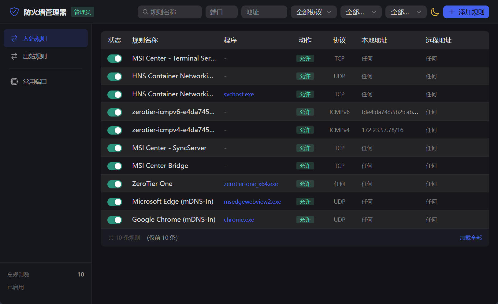

# 防火墙管理器 / Firewall Manager

<p align="center">
  
</p>

<p align="center">
  轻量、美观的 Windows 防火墙规则管理桌面工具
</p>

<p align="center">
  
  
  
  
  
</p>

---

[English](#english) | [中文](#中文)

## 中文

### 简介

每次修改 Windows 防火墙规则都要打开控制面板层层点击？这个工具帮你解决。

一个基于 [Wails v2](https://wails.io) 开发的 Windows 防火墙管理桌面应用，界面简洁，中文友好，打包为单个 exe 文件，无需安装。

### 功能

- 🔍 **规则浏览** — 查看所有入站/出站防火墙规则
- ✏️ **规则管理** — 添加、编辑、删除、启用/禁用规则
- 🔎 **智能搜索** — 按名称、端口、地址分栏搜索，支持协议、动作、状态下拉筛选
- 📏 **列宽拖拽** — 拖拽表头边框自定义列宽
- 🌗 **明暗主题** — 一键切换深色/浅色主题
- 🇨🇳 **中文适配** — 完整支持中文 Windows 的 GBK 编码输出

### 截图

<p align="center">
  
</p>

### 下载

前往 [Releases](https://github.com/whyy1/firewall-manager/releases) 页面下载最新版本。

### 从源码构建

**环境要求：**
- Go 1.23+
- Node.js 18+
- Wails CLI v2

```bash
# 安装 Wails CLI
go install github.com/wailsapp/wails/v2/cmd/wails@latest

# 克隆项目
git clone https://github.com/whyy1/firewall-manager.git
cd firewall-manager

# 安装前端依赖
cd frontend && npm install && cd ..

# 开发模式
wails dev

# 生产构建
wails build
```

构建产物位于 `build/bin/firewall-manager.exe`。

> ⚠️ 防火墙操作需要管理员权限，程序启动时会自动请求 UAC 提权。

### 技术栈

| 层级 | 技术 |
|------|------|
| 框架 | [Wails v2](https://wails.io) |
| 后端 | Go + netsh advfirewall |
| 前端 | Vue 3 + Vite + [Naive UI](https://www.naiveui.com) |
| 图标 | Ionicons 5 |

### 项目结构

```
├── main.go / app.go           # Wails 入口与前端绑定
├── internal/
│   ├── firewall/              # 防火墙操作封装
│   └── admin/                 # 管理员权限检测
├── frontend/
│   └── src/
│       ├── components/        # Vue 组件
│       ├── stores/            # 状态管理
│       └── styles/            # 全局样式
└── build/                     # 构建资源与打包配置
```

---

## English

### About

A lightweight, elegant desktop tool for managing Windows Firewall rules, built with [Wails v2](https://wails.io).

No more digging through Control Panel — manage all your firewall rules from a single, clean interface.

### Features

- 🔍 **Browse Rules** — View all inbound/outbound firewall rules
- ✏️ **Manage Rules** — Add, edit, delete, enable/disable rules
- 🔎 **Smart Search** — Filter by name, port, address with protocol/action/status dropdowns
- 📏 **Resizable Columns** — Drag table header edges to resize columns
- 🌗 **Dark/Light Theme** — Toggle between dark and light themes
- 🇨🇳 **Chinese Windows Support** — Full GBK encoding support for netsh output

### Download

Go to the [Releases](https://github.com/whyy1/firewall-manager/releases) page to download the latest version.

### Build from Source

**Requirements:**
- Go 1.23+
- Node.js 18+
- Wails CLI v2

```bash
# Install Wails CLI
go install github.com/wailsapp/wails/v2/cmd/wails@latest

# Clone the project
git clone https://github.com/whyy1/firewall-manager.git
cd firewall-manager

# Install frontend dependencies
cd frontend && npm install && cd ..

# Development mode
wails dev

# Production build
wails build
```

The output binary will be at `build/bin/firewall-manager.exe`.

> ⚠️ Firewall operations require administrator privileges. The app will request UAC elevation on startup.

### Tech Stack

| Layer | Technology |
|-------|------------|
| Framework | [Wails v2](https://wails.io) |
| Backend | Go + netsh advfirewall |
| Frontend | Vue 3 + Vite + [Naive UI](https://www.naiveui.com) |
| Icons | Ionicons 5 |

### Project Structure

```
├── main.go / app.go           # Wails entry point & frontend bindings
├── internal/
│   ├── firewall/              # Firewall operations (netsh wrapper)
│   └── admin/                 # Admin privilege detection
├── frontend/
│   └── src/
│       ├── components/        # Vue components
│       ├── stores/            # State management
│       └── styles/            # Global styles
└── build/                     # Build assets & packaging config
```

## License

[MIT](LICENSE)
